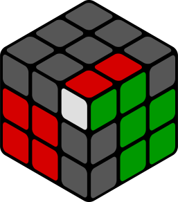
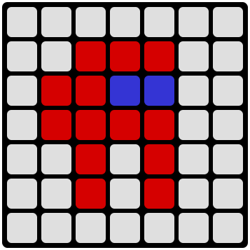

# Rubik-Render

Rubik-Render is a Go-based API service that generates SVG images of Rubik's cubes based on a given configuration. The service allows users to customize the cube's size, view (isometric, flat, or unfolded), and color for each side. This tool supports cubes and cuboids of various dimensions.

<p align="center"></p>

## Features

- **Multiple views**: Generate the Rubik's cube in different views, including:
  - `isometric`: 3D isometric view.
  - `flat`: Top-down or side view.
  - `unfolded` (coming soon): Flat layout showing all sides of the cube.

- **Customizable size**: Create cubes and cuboids with dimensions ranging from 1x1x1 to 64x64x64.

- **Color specification**: Customize the colors for each side of the cube using a flexible notation.

## API Endpoints

### Request

`GET` **`/cube/{view}/{size}/{colors}`**

- `view`: The display view for the cube. Options: `isometric`, `flat`, `unfolded` (coming soon).
- `size`:
  - For `isometric`: Cube or cuboid dimensions in the format `{x}x{y}x{z}`.
  - For `flat`: Dimensions should be provided in the format `{x}x{y}`, as it only represents the top and adjacent sides of the cube.

- `colors`:
  - For `isometric`: Colors should be provided in the format `{left}-{top}-{right}-{base}`.
  - For `flat`: Colors should be provided in the format `{front}-{left}-{top}-{right}-{down}-{base}`.

### Example Requests (Isometric)

- **Isometric view of a 3x3x3 cube with red on the left, white on the top, blue on the right, and black as the base**:

  `GET` **`http://localhost:8080/cube/isometric/3x3x3/R-W-B-K`**

  <details><summary>Click to view the SVG image</summary><p align="center"></p></details>

- **Isometric view of a 3x3x3 cube with a "Chessboard" pattern, where opposite colors alternate**:

  `GET` **`http://localhost:8080/cube/isometric/3x3x3/ROROROROR-WYWYWYWYW-BGBGBGBGB`**

  <details><summary>Click to view the SVG image</summary><p align="center"></p></details>

- **Isometric view of a 3x3x3 cube with a black base and completely gray cells**:

  `GET` **`http://localhost:8080/cube/isometric/3x3x3/X`**

  <details><summary>Click to view the SVG image</summary><p align="center"></p></details>

- **Isometric view of an inverted 3x3x3 cube, where the white side is black, and the base is white**:

  `GET` **`http://localhost:8080/cube/isometric/3x3x3/R-K-B-W`**

  <details><summary>Click to view the SVG image</summary><p align="center"></p></details>

- **Isometric view of a void 3x3x3 cube, where the centers are missing**:

  `GET` **`http://localhost:8080/cube/isometric/3x3x3/RRRRTRRRR-WWWWTWWWW-BBBBTBBBB`**

  <details><summary>Click to view the SVG image</summary><p align="center"></p></details>

- **Isometric view of a 3x3x3 cube that shows an F2L situation solvable with the formula U R U' R'**:

  `GET` **`http://localhost:8080/cube/isometric/3x3x3/XXWRRXRRX-XXXXXXRRX-GGXXGGXGG`**

  <details><summary>Click to view the SVG image</summary><p align="center"></p></details>

- **Isometric view of a 2x3x2 cuboid known as the QiYi MofangGe 223 Cube**:

  `GET` **`http://localhost:8080/cube/isometric/2x3x2/G-W-R`**

  <details><summary>Click to view the SVG image</summary><p align="center"></p></details>

- **Isometric view of a 3x3x3 cube showing the scramble from the [Wikipedia image](https://en.wikipedia.org/wiki/Rubik%27s_Cube#/media/File:Scrumbled_Rubik's_Cube.jpg)**:

  `GET` **`http://localhost:8080/cube/isometric/3x3x3/BGGORRGGO-OOYYGYYOW-OGRGWRBWG`**

  <details><summary>Click to view the SVG image</summary><p align="center"></p></details>

- **Isometric view of a cute 1x1x1 Rubik's cube**:

  `GET` **`http://localhost:8080/cube/isometric/1x1x1/R-W-B`**

  <details><summary>Click to view the SVG image</summary><p align="center"></p></details>

### Example Requests (Flat)

- **Flat view of a 2x2 cube with yellow on the front, red on the left, blue on the top, orange on the right, and green on the bottom**:

  `GET` **`http://localhost:8080/cube/flat/3x3/Y-R-B-O-G`**
  
  <details><summary>Click to view the SVG image</summary><p align="center"></p></details>

- **Flat view of a 3x3 cube showing an OLL case, known as the "T" shape**:

  `GET` **`http://localhost:8080/cube/flat/3x3/XXYYYYXXY-YXY-XYX-X-XYX`**

  <details><summary>Click to view the SVG image</summary><p align="center"></p></details>

- **Flat view of a 7x7 cube with Among Us-themed artwork (inspired by the [YouTube short](https://youtube.com/shorts/tqdcjIoi75Q))**:

  `GET` **`http://localhost:8080/cube/flat/7x7/WWWWWWWWWRRRWWWRRBBWWWRRRRWWWWRWRWWWWRWRWWWWWWWWW`**

  <details><summary>Click to view the SVG image</summary><p align="center"></p></details>

- **Flat view of a 2x2 Rubik's cube showing an OLL case called "Fish" with a transparent base**:

  `GET` **`http://localhost:8080/cube/flat/2x2/XYXX-YX-XX-XY-YX-T`**

  <details><summary>Click to view the SVG image</summary><p align="center"></p></details>

### Color Notation

- Each character corresponds to a color (see Color Mapping).
- A hyphen `-` is used to separate sides, for example, `{left_side}-{top_side}`.
- If a single letter is specified, for example, `R`, then all elements on that side will be red.
- If more than one letter is specified, for example, `RGB`, then all elements on that side will be filled sequentially from left to right, top to bottom. If there are fewer letters than elements on the side, all remaining elements will be filled with the default color.
- If no letter is specified, for example, `--`, then all elements on that side will be the default color.
  - Default color for the base - black `K`
  - Default color for sides - gray `X`
  - Default color for side elements in `flat` view - transparent `T`

### Color Mapping

- `R`: Red
- `G`: Green
- `B`: Blue
- `Y`: Yellow
- `W`: White
- `O`: Orange
- `X`: Gray
- `K`: Black
- `T`: Transparent

## Installation

To run the service locally:

```bash
git clone https://github.com/Dunamis4tw/rubik-render.git
cd rubik-render
go mod tidy
go run main.go
```

The service will be available at http://localhost:8080.

## License

This project is licensed under the MIT License - see the LICENSE file for details.
